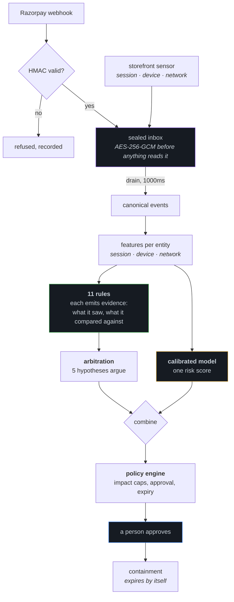
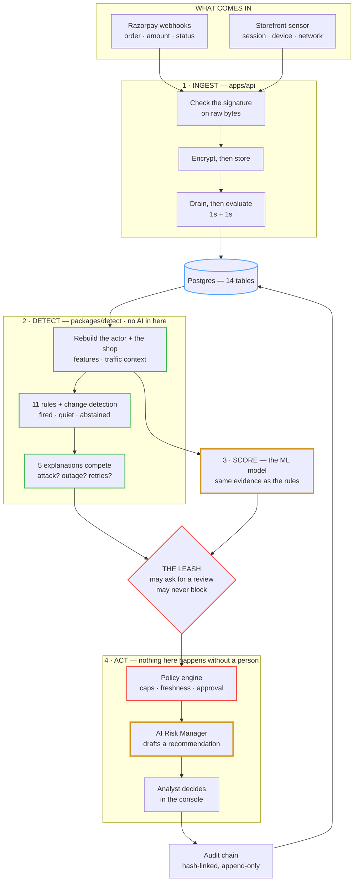

<div align="center">

# Sentinel

### Card-testing detection for merchants, with the reasoning shown

Sentinel watches a merchant's own payment traffic, decides whether a burst of failures is an attack
or something innocent that looks like one, and shows every number behind the answer.

**No shopper is ever blocked on a model's word alone.**

[](.github/workflows/verify.yml)
[](#6--verification)
[](#4--what-it-measures)
[](#5--architecture)
[](LICENSE)

Razorpay Buildathon 2026 · Track 02, AI Risk Manager

<p align="center">
  <a href="docs/asset/project-teaser.mp4">
    
  </a>
</p>

</div>

|                     |                                                                                                                                                        |
| :------------------ | :----------------------------------------------------------------------------------------------------------------------------------------------------- |
| **Live console**    | [sentinel-api.happytree-e373af54.uaenorth.azurecontainerapps.io](https://sentinel-api.happytree-e373af54.uaenorth.azurecontainerapps.io)                  |
| **Live storefront** | [sentinel-shop.happytree-e373af54.uaenorth.azurecontainerapps.io](https://sentinel-shop.happytree-e373af54.uaenorth.azurecontainerapps.io)                |
| **Sign in**         | `analyst@sentinel.local` · `sentinel-demo`                                                                                                               |
| **Teaser video**    | [`project-teaser.mp4`](docs/asset/project-teaser.mp4) — full quality, 40s                                                                                          |

> [!NOTE]
> **Both apps sleep when nobody is using them.** The first visit after a quiet period waits about
> **10 seconds** for a container to start, and the tab stays blank until it does. Leave it open
> rather than reloading. The console's storefront link says so before it opens the tab, and starts
> the wake while you read it.

To see the whole thing work: sign in, open **Simulation**, run `attack_distributed`, and watch an
incident open with the evidence attached.

---

## 1 · The problem

Card testing is someone running stolen card numbers through a checkout to find the live ones. On a
merchant's dashboard it looks like an ordinary bad afternoon: a spike of failures, mostly declines,
clustered in time. So does an acquirer outage. So does a biller's dunning run. So does a flash sale.

Two things make it hard to tell apart.

**The attempts arrive disconnected.** A payment webhook carries an order, an amount and a status. It
carries no session, no device, no network. Thirty attempts from one attacker across thirty sessions
arrive as thirty unrelated events.

**Alerting per failure buries the answer.** Sixty notifications for one attacker is not sixty
problems. It is one problem reported sixty times, with the shape of it lost in the noise.

Sentinel joins the attempts back together, argues the case out loud, and produces one reviewable
incident with the evidence attached.

## 2 · Defence-only

Nothing in this repository can generate, replay or initiate a payment against anyone.

|            |                                                                                                |
| :--------- | :--------------------------------------------------------------------------------------------- |
| **Reads**  | Razorpay webhooks the merchant already receives, and an optional first-party storefront sensor  |
| **Writes** | Its own database, and containment decisions a person approved                                   |
| **Never**  | Issues a charge, touches a card number, calls a third party, or blocks without approval         |

The simulator streams recorded attack _shapes_ through the real pipeline. It uses no real card
numbers, contacts nothing outside the process, and its traffic is tagged `replay` end to end so it
can never be counted as evidence about live behaviour.

## 3 · How a decision gets made



**Rules produce evidence, not a verdict.** Each of the 11 returns one of three answers: it fired, it
was quiet, or it abstained because it could not see enough to say. Abstention is recorded and shown,
because a rule that cannot see is not a rule that saw nothing. Every fired rule carries the number it
saw and the number it compared against, so the console never has to say "it looked suspicious".

**Five explanations argue against each other**, and the winner is the one the evidence best fits
rather than the first rule to fire: `attack`, `outage`, `retry_storm`, `healthy_traffic`,
`insufficient_evidence`.

**The model is on a leash.** It can raise a review; it can never contain anyone. Where arbitration
positively names `healthy_traffic`, `retry_storm` or `outage`, the model may not escalate over that
explanation — but `insufficient_evidence` is not a veto, because where the rules could not decide is
exactly where the model is allowed to speak. With no model artifact at all the rules carry on and the
decision is marked `degraded:model`.

**Containment expires.** It needs a person's approval, lasts 30 minutes under the shipped policy
(120 maximum, at most two extensions), and lifts the moment it is released. Being wrong costs
minutes, not customers.

The full path, the entity model, and every degradation route are in
[ARCHITECTURE](docs/ARCHITECTURE.md).

## 4 · What it measures

A gradient-boosted ensemble with temperature scaling, trained in Python and exported as node arrays
the API walks directly, so the served model is the trained model rather than a reimplementation of
it. Held out on a **grouped** split, so no entity appears in both train and test.

|           |     Value | 95% CI         |
| :-------- | --------: | :------------- |
| PR-AUC    | **0.991** | [0.986, 0.995] |
| Recall    | **0.979** | [0.961, 0.993] |
| Precision | **0.875** | [0.836, 0.909] |
| ROC-AUC   |     0.997 |                |
| Brier     |     0.017 |                |

A no-skill baseline scores **0.211**. The test set is **1,325 entities — 280 attack, 1,045 benign**,
and the model flags 39 of the benign ones. Those two percentages are measured over different
populations and are not complements: the number that pairs with 97.9% recall is the 2.1% of attacks
missed.

**That is the model alone, and the model does not decide alone.** The second measurement is the rules
and arbitration running the full pipeline over the committed scenario corpus, regenerated by CI on
every build into [`METRICS.md`](METRICS.md):

| Non-attack scenario | Entities | Contained | Sent to review |
| :------------------ | -------: | --------: | -------------: |
| `normal_traffic`    |      144 |         0 |              0 |
| `customer_error`    |      119 |         0 |              0 |
| `gateway_outage`    |      177 |         0 |              0 |
| `retry_storm`       |        6 |         0 |              0 |
| `flash_sale`        |      496 |         0 |              0 |

**Zero false positives across 1,105 entities judged**, in 11 scenario families, with every attack
family recognised — four contained outright and two escalated to a person.

The gap between the two tables is the point. Left alone the model would flag roughly 4 in every 100
benign entities, and nearly all of them are billers retrying their own failures. The rules recognise
those as `retry_storm` and refuse to let the model escalate over them. That is what the leash buys,
stated as a number, and it is why the model's own false-positive rate is published rather than
buried.

Two attack shapes still get past: card reuse at 37 of 42, and a loud attack hidden inside dunning at
10 of 11. The labels are synthetic, generated from disclosed attack specifications, so until a
merchant's own confirmed incidents replace them these numbers describe behaviour against a
specification rather than against the field.

Every figure above, the checks that would catch us publishing a wrong one, and the full list of what
is still broken are in [PROOF](docs/PROOF.md).

## 5 · Architecture

Four stages, top to bottom. **The two amber boxes are the only places any AI runs.**



Reading down it is roughly reading trust being established: nothing from Razorpay is believed
until the signature check passes, nothing is readable on disk once sealed, anything leaving
arbitration carries its evidence, and nothing reaches a shopper until a named person approves
it. [ARCHITECTURE](docs/ARCHITECTURE.md) takes each stage apart.

Three applications and ten packages in one pnpm + Turborepo workspace. Node 22, TypeScript 5.7.

|                                                                       |                                                                      |
| :-------------------------------------------------------------------- | :------------------------------------------------------------------- |
| `apps/api`                                                            | NestJS 11 — ingestion, detection, policy, audit, and the console API  |
| `apps/web`                                                            | React 19 + TanStack Router/Query — the console                        |
| `apps/storefront`                                                     | A demo shop that produces real checkout traffic                       |
| `packages/detect`                                                     | Rules, features, hypotheses, incidents. No I/O, no framework          |
| `packages/policy`                                                     | The policy engine and its parser                                      |
| `packages/contracts`                                                  | Zod schemas shared by both sides of every call                        |
| `audit` · `corpus` · `db` · `narrate` · `risk-manager` · `load` · `ui` | Supporting packages                                                   |

Detection is a pure library with no database, no HTTP and no clock of its own. That is why 152 of its
tests run in milliseconds, and why the same code can be driven by a webhook or by the simulator
without knowing which.

### Where the AI is, and how it is fenced

| Layer       | What it does               | Fence                                                        |
| :---------- | :------------------------- | :----------------------------------------------------------- |
| Rules       | Deterministic evidence     | No learning. Same input, same output, forever                |
| Model       | One calibrated risk score  | Cannot contain. Cannot overrule a named benign cause         |
| Arbitration | Picks the best explanation | Deterministic given the evidence                             |
| Policy      | Decides what may be done   | Human approval, caps, expiry                                 |
| Narration   | Explains in words          | Emits claim ids only; every sentence maps to a recorded fact |
| Copilot     | Answers questions on a case | Context is PII-free by construction; unreachable returns no answer, never an invented one |

### Deployment

Two independently scaled applications on Azure Container Apps in `uaenorth`, built from this
repository by GitHub Actions. Nothing reaches production that has not passed the same gate a pull
request passes, because the deploy workflow calls `verify` first and stops if it is red. A deploy
changes only `--image`: every variable, secret and scaling rule lives in `azure-setup.yml` and is
applied deliberately, so a push to `main` can change _what_ runs and never _how it is configured_.

The API and the console are served from one origin, so the session cookie and the API that issues it
belong together and the authenticated path needs no CORS. Credentials are GitHub OIDC, with no cloud
secret stored anywhere. [SETUP_AND_DEPLOY](docs/SETUP_AND_DEPLOY.md) has the pipeline diagram and the
provisioning steps.

## 6 · Verification

```bash
pnpm check     # the whole gate, exactly as CI runs it
```

|            |   Count |                                         |
| :--------- | ------: | :-------------------------------------- |
| Unit       | **802** | Across all 13 workspaces                |
| End-to-end |  **28** | Playwright, against a real server       |
| ML         |  **29** | pytest, including cross-language parity |

Eight CI gates, all blocking: `lint` · `typecheck` · `test:unit` · `check:format` · `check:payload` ·
`check:docker` · `check:metrics` · `assert nothing changed`.

Three of them are the ones that matter here. **`check:payload`** greps the built output for anything
resembling a card number, an email or a contact number reaching a log. **`check:metrics`** re-runs
the evaluation and fails if any published number moved, so the figures in this README cannot drift
from the artifacts without CI noticing. **`assert nothing changed`** fails if any gate modified a
tracked file, because a formatter or a regenerated artifact silently fixing the tree is itself a
failure.

Cross-language parity is asserted below **1e-8** by a test that reimplements the tree walker
independently rather than calling the trained model, so a disagreement means one of them is wrong
about the artifact.

## 7 · Security and privacy

| Control              | Implementation                                           |
| :------------------- | :-------------------------------------------------------- |
| Webhook authenticity | HMAC-SHA256 over the raw bytes, before parsing            |
| Payload at rest      | AES-256-GCM envelope, sealed before anything reads it     |
| Identifiers          | Keyed HMAC pseudonyms, versioned                          |
| Card data            | Never received, never stored. Sentinel sees no PAN        |
| Secrets              | GitHub OIDC. No stored cloud credential                   |
| Leak prevention      | A CI gate that greps the build output                     |
| Audit                | Hash-linked chain; each entry commits to its predecessor  |

What regulation applies and the full threat model are in [COMPLIANCE](docs/COMPLIANCE.md).

## 8 · Documentation

This README is the overview. Six documents carry the detail.

|                                              |                                                                                                               |
| :------------------------------------------- | :------------------------------------------------------------------------------------------------------------ |
| [ARCHITECTURE](docs/ARCHITECTURE.md)         | System shape, the ingestion path, the entity model, the data model, and every degradation path                 |
| [PROOF](docs/PROOF.md)                       | Every measured number, how the corpus was built, the checks that could catch us lying, and what is still wrong |
| [DECISIONS](docs/DECISIONS.md)               | The twelve choices that shaped it, including the two that were later reversed                                  |
| [ENGINEERING_LOG](docs/ENGINEERING_LOG.md)   | Thirteen things that broke, what caused each, and what fixed it                                                |
| [COMPLIANCE](docs/COMPLIANCE.md)             | What regulation applies, and the threat model                                                                  |
| [SETUP_AND_DEPLOY](docs/SETUP_AND_DEPLOY.md) | Local from a clean clone, and Azure from scratch                                                               |

Two files are regenerated by CI and are the authority for every figure quoted anywhere:
[`METRICS.md`](METRICS.md) and
[`ml/models/incident/artifacts/`](ml/models/incident/artifacts/).

## 9 · Running it locally

No database, no Razorpay account, no cloud anything. Postgres is compiled to WebAssembly and runs
in-process.

```bash
pnpm install
cp .env.example .env
node -e "console.log(require('crypto').randomBytes(32).toString('hex'))"   # PSEUDONYM_KEY_V1
node -e "console.log(require('crypto').randomBytes(32).toString('hex'))"   # PAYLOAD_KEY_V1
pnpm dev
```

Console on `:5173`, storefront on `:5174`, API on `:3001`. Sign in with
`analyst@sentinel.local` / `sentinel-demo`.

Those two keys are the only values without defaults, and neither has a fallback — one baked into the
source would make every pseudonym on every install reproducible by anyone. `PSEUDONYM_KEY_V1` is
required to boot at all; `PAYLOAD_KEY_V1` is required before the webhook endpoint will accept a
delivery, so a customer's email is never stored in plaintext.

Every variable the code reads is documented in [`.env.example`](.env.example), and
[SETUP_AND_DEPLOY](docs/SETUP_AND_DEPLOY.md) covers a clean clone and an Azure deployment from
scratch.

---

<div align="center">

Built for Razorpay Buildathon 2026 · Track 02, AI Risk Manager

**Not an official Razorpay product.**

</div>
