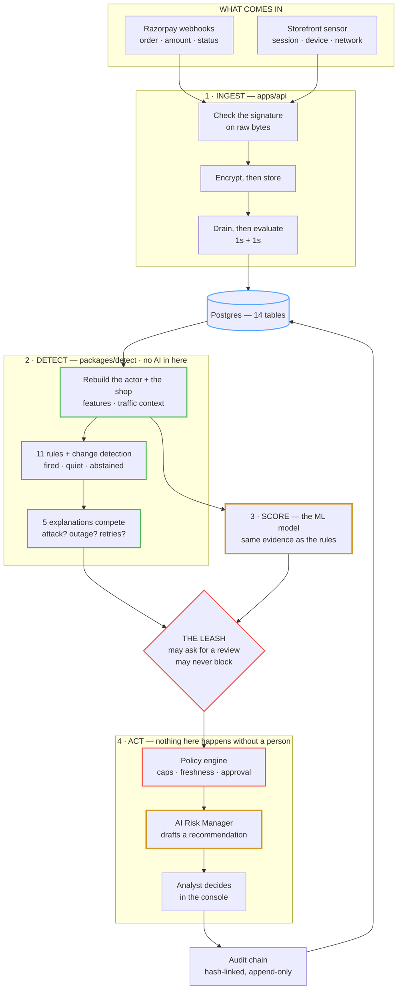
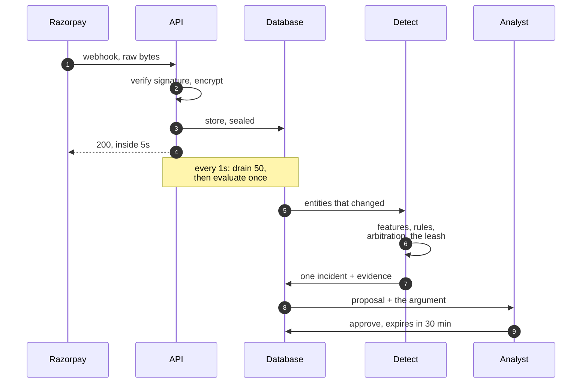
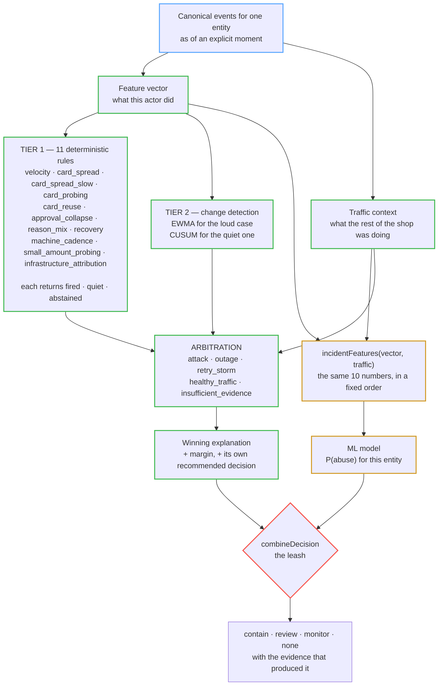
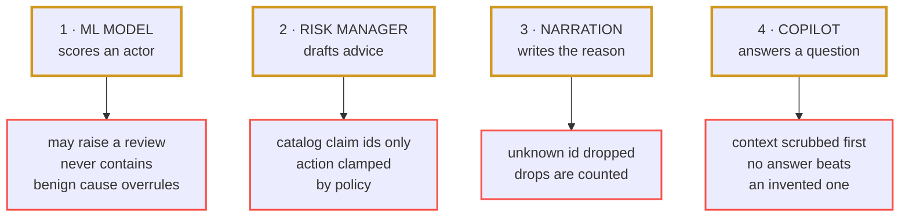
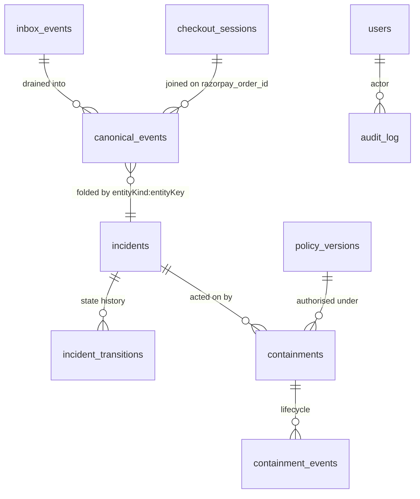

# Sentinel — System Architecture

**A merchant-side card-testing detector that reaches a defensible verdict and can be held to it.**

Razorpay Buildathon 2026 · Track 02, AI Risk Manager

| | |
| :-- | :-- |
| **Runtime** | Node 22 · TypeScript 5.7 · pnpm + Turborepo |
| **Composition** | 3 apps · 10 packages · 22 controllers · 65 routes · 14 tables |
| **Detection latency** | ~2s — 1s drain tick + 1s evaluation debounce. ~6s on the deployed container, whose drain tick is 5s |
| **Decision tiers** | 11 deterministic rules · EWMA/CUSUM change detection · calibrated GBDT |
| **Model authority** | May raise a review. May never contain |
| **Verification** | 8 blocking CI gates · 800 unit · 28 e2e · 29 ML tests |

Every figure here comes from a file in this repository; §9 gives the command that checks each one.
Where a component exists but is not wired into the live path, it says so.

**Companion documents.** [PROOF](PROOF.md) — measured results and known limits.
[COMPLIANCE](COMPLIANCE.md) — data protection and threat model.
[SETUP_AND_DEPLOY](SETUP_AND_DEPLOY.md) — running and deploying it.
[DECISIONS](DECISIONS.md) — why it is shaped this way.

---

## 1 · The problem this shape solves

Card testing is somebody running stolen card numbers through a checkout to find the ones that still
work. On a dashboard it looks like any other bad afternoon: a cluster of declines. So does an acquirer
outage, a biller retrying its failures, and a flash sale.

Two problems shape everything that follows.

Payment webhooks arrive already disconnected. A webhook gives you the order, the amount and the
status, but not the session, the device or the network. Thirty attempts from one attacker across
thirty sessions arrive as thirty unrelated events.

And no single entity holds enough to tell an outage from an attack. Both look like a session failing
repeatedly. What separates them is whether everybody else is failing too, which is a fact about the
shop rather than the session. Scoring entities in isolation loses this case before it starts.

So the system reconstructs the actor behind the attempts, and judges it against what the rest of the
shop was doing at the same moment.

---

## 2 · System architecture

Four stages, top to bottom. **The two amber boxes are the only places any AI runs.**



Reading down the diagram is roughly reading trust being established. Nothing from Razorpay is believed
until the signature check passes, nothing is readable on disk once sealed, anything leaving
arbitration is an argument with its evidence attached, and nothing reaches a shopper until a named
person approves it.

The detect stage is worth calling out for what it lacks. `packages/detect` holds no database handle,
no HTTP client and no clock; the time is passed in as an argument. So its 152 tests run in
milliseconds, the same code serves a live webhook and the simulator without knowing which, and the
whole corpus replays inside one process, which is why `check:metrics` runs on every build instead of
overnight.

---

## 3 · From webhook to evidence



Three details there are deliberate.

The signature is checked against the raw bytes, before parsing. Re-serialising to verify would change
whitespace and key ordering, which works until a payload happens to serialise differently and then
fails intermittently for reasons nobody can reproduce.

The payload is encrypted before it is read, so a crash between receipt and processing leaves
ciphertext on disk rather than a customer's email in a queue table.

Evaluation runs once per batch, not once per event. A drain pass sets a single 1,000ms timer and later
passes fold into it, so an attack arriving as sixty webhooks is judged once.

The drain tick itself is configurable and the deployment raises it. Azure Container Apps bills a
replica at the active rate once it exceeds 0.01 vCPU, and a drain waking every second keeps tripping
that, so `INBOX_DRAIN_INTERVAL_MS` is 5000 there. Detection on the live deployment therefore lands
about six seconds after a webhook rather than two.

### 3.1 · Three entity kinds

Every attempt is projected onto three entities: the browser session, the device, and the `/24` network
block, each judged independently on every pass.

Incidents key on `entityKind:entityKey`, so one attacker can raise more than one. That looks like
duplication until you try to act: containing a session and containing a subnet have very different
blast radii, and merging them would force an operator to accept the larger to get the smaller.

### 3.2 · Recency by decay, not a window

```
f(t₂) = f(t₁) / 2^((t₂ − t₁) / halfLife)        halfLife = 5 minutes
```

A sliding window has a cliff. An attack that stops ninety seconds before a two-minute window closes
vanishes the moment the window rolls past it, and a threshold near that edge flickers as events age
out one at a time. Decay makes recency continuous, so nothing changes state because a clock ticked.

### 3.3 · Sketch to find, exact to decide

Distinct cards is the most discriminating count in the corpus: enumeration walks many cards, dunning
hammers a few, and both produce similar failure counts.

So it is counted twice. A HyperLogLog sketch (precision 12, about 4 KB, ~1.6% standard error) narrows
ten thousand candidates to a handful cheaply, then the exact count is re-derived from the events
before any rule may act on it. While that confirmation is outstanding `card_spread` abstains rather
than firing on the estimate. No decision reaching a shopper rests on an approximation.

### 3.4 · The population, alongside the entity

`computeTraffic` sits beside the feature vector rather than inside it. A vector answers "what did this
entity do"; a context answers "was that unusual here, just now". Arbitration reads both, and will
reach different conclusions from two identical vectors depending on the second.

---

## 4 · The reasoning layer



Every input is drawn, because the joins are the design. **`FV` and `TC` both come from the same
observations** — one reduces them to this actor, the other to the population around it. **The model
and arbitration receive both**, so neither is working from evidence the other cannot see. And
arbitration produces its *own* recommended decision, which `combineDecision` then reconciles with the
model's score — the leash is a reconciliation of two opinions, not a filter on one.

### 4.1 · Two deterministic tiers, because one has a floor

Tier 1 asks whether a rate is above some number, and that has a floor it can never get under: an
attacker who stays below the threshold stays invisible forever.

Tier 2 asks "has this changed" instead, which has no such floor. EWMA covers the loud case, reacting
within a few buckets against its own control limit. CUSUM covers the quiet one, accumulating how much
each bucket exceeds normal so a shift too small to trip any threshold still adds up.

### 4.2 · Rules return three answers

A rule **fired**, giving the value it saw and the threshold it compared against; was **quiet**,
having looked and found nothing; or **abstained**, unable to see enough to have an opinion.

The third matters more than it sounds. `card_spread` abstains while the distinct-card sketch is
unconfirmed; `machine_cadence` abstains below a minimum attempt count, because the variation between
two arrival times is noise, not rhythm. Recorded as a quiet zero, thin evidence would read as
exoneration, and it would read that way against a shopper.

The score is a plain sum of the evidence, so every term is in the list and removing one changes the
number by exactly its weight. Abstentions widen the interval around it in whichever direction they
might have moved it, and a wide interval becomes its own reason to wait. Policy refuses containment
outright when arbitration abstained.

### 4.3 · Five explanations compete

| Hypothesis | Argues | Suppresses action |
| :-- | :-- | :--: |
| `attack` | Deliberate card testing | |
| `outage` | The acquirer is failing, not the shopper | ● |
| `retry_storm` | A biller retrying its own failures | ● |
| `healthy_traffic` | An ordinary busy hour | ● |
| `insufficient_evidence` | Not enough signal to say | |

The winner is whichever explanation fits the evidence best, and it has to win by at least 0.08. It is
not the first rule that fired. Three of the five argue against acting when they win, which is what
lets a very loud pile of failures be correctly left alone.

---

## 5 · The ML model

This is the learned part of the system. It produces a score. What that score is allowed to do is
covered in §6.

### 5.1 · What is served

| | |
| :-- | :-- |
| **Type** | Gradient-boosted trees — `kind: binary_risk_trees`, **200 trees** |
| **Calibration** | Temperature scaling, `T = 1.698`, fit on validation to minimise negative log-likelihood |
| **Inputs** | 10 features, fixed order, hashed as the feature-definition version |
| **Output** | One number: P(abuse) for this entity |
| **Operating point** | Block at **0.07**, review at **0.015** — cost-optimal, not 0.5 |
| **Serving** | Exported as plain node arrays the API walks in TypeScript. No Python, no ONNX, no native runtime |

### 5.2 · It reads exactly what the rules read

`incidentFeatures(vector, traffic)` takes the same two inputs arbitration takes: what this actor
did, and what the rest of the shop was doing at the same moment.

```
log_attempts · failure_rate · approval_rate · infra_share · cards_per_attempt
small_amount_share · burstiness · recovery_rate · top_session_failure_share · log_failing_sessions
```

The model gets no private signal the deterministic tier cannot also see. It weighs the same facts
differently, which is what makes a disagreement between them informative: you can look at the same
evidence and work out which is reading it better.

The order matters. Served weights are indexed by position, and the Python side hashes the list as the
feature-definition version, so reordering forces a retrain. The hash enforces it.

One of the ten is worth explaining, because getting it wrong inverted the detector.

> `infra_share` counts failures Razorpay attributed to the **gateway**, and specifically not the ones
> attributed to the **bank**.
>
> When an issuer declines a card, Razorpay records it as a bank failure. So `bank` is exactly what
> enumeration produces, and it is the majority failure source in every attack scenario in the corpus.
> An early version counted both as infrastructure, which made the feature read close to 1.0 for a
> dunning run and pointed the detector the wrong way. Only `gateway` names a component that broke, as
> opposed to a card that was refused.

### 5.3 · The served model is the trained model

Training happens in Python, serving in TypeScript. That split is only safe if the two agree, so the ML
suite asserts they stay within 1e-8 on the same input.

What makes it a real check is how the test is written: it reimplements the tree walker from scratch
instead of calling the model, *"deliberately kept dumb and separate… if the two ever disagree, one of
them is wrong about the artefact."* Getting inside that bar meant raising export precision from 8
decimal places to 10; at 8 the two drifted by 3.1e-8, which would have gone unnoticed.

### 5.4 · Why a tree ensemble, and what it cost

The ensemble replaced a calibrated logistic regression on measurement, not preference: same grouped
split, same cost model, PR-AUC 0.991 against 0.940, winning on all five stability seeds.

The linear model's real advantage was exact per-feature coefficients, and that was not given up.
Attribution is now median ablation: hold one feature at its training median, score again, report the
difference.

```ts
const contributions = raw.map((_, i) => {
  const ablated = [...raw];
  ablated[i] = model.featureMedians[i]!;
  return risk - treeRisk(model, ablated);        // what this signal did, here
});
```

Arguably the better answer anyway: a coefficient says what a signal does on average, an ablation says
what it did on the case in front of you. The ensemble only shipped because attribution survived.

### 5.5 · Losing it is survivable

With no artifact, scoring reports unavailable and the rules carry on alone, stamped `degraded:model`.
You lose the model's opinion, not the safety of the decision. See §8 for every dependency's behaviour.

---

## 6 · The AI, and what governs it

Four parts of the system are either learned or generative. None of them can take an action, and
each is fenced in a way that suits what it produces.



### 6.1 · The leash on the model

`packages/detect/src/decision.ts` is about forty lines long, and it is where all of the model
governance lives.

| Condition | Result |
| :-- | :-- |
| No model artifact | Rules decide alone; marked `degraded:model` |
| Model says attack · rules not acting · **no benign cause named** | Escalate to **`review`** |
| Model says attack · **arbitration named a benign cause** | **Vetoed.** The deterministic explanation wins |
| Model says benign · rules want to contain | De-escalated to `review` |
| Model agrees with acting rules | Recorded as corroboration; decision unchanged |

`insufficient_evidence` is not a veto: where the rules could not decide is exactly where the model is
allowed to speak. Only a positively named benign cause silences it.

Worth a number. Left to itself the model flags 39 of 1,045 benign entities, nearly all billers
retrying their own failures. Run the full pipeline over the same corpus and the system contains 0 of
the 1,105 it judges. That gap is the leash working, and it is why the model's false-positive rate is
published rather than omitted ([PROOF §3](PROOF.md#3--the-system)).

### 6.2 · The fact guard on the generative tier

The AI Risk Manager reads an already-verified incident record plus the policy preview, and drafts a
recommendation. It is not free to write whatever it likes.

It may only name claim ids from a fixed catalog. An id outside the catalog is treated as a
hallucination and dropped; an id whose claim does not apply to these facts is dropped too. The count
of drops comes back as a field on the result, not a log line, because a reasoning layer that keeps
naming claims which do not exist is one going wrong, and that has to be measurable.

Its proposed action is clamped by `clampToCeiling` to what the rules and policy already support. No
tier, *"least of all a remote model"*, can push past the existing authority.

Accepting a recommendation opens no shortcut: it goes through the same propose-and-approve path a
human action uses, and lands in the audit chain with the reasoning version and a grounding hash.

### 6.3 · Degrading without changing the answer

```
live (Groq)  →  local (deterministic)  →  replay (recorded)  →  template (cannot fail)
```

A circuit breaker opens after three failures with a ten second cooldown, behind a ten second timeout.
When the provider goes away, replay reproduces the same selection from its recording, so the
recommendation does not change, only the badge saying where it came from.

The shipped default is `RISK_MANAGER_MODE=local`: deterministic, no language model, no network call.

### 6.4 · The copilot, and why it is fenced differently

An analyst can ask the console questions in plain English about one incident.
`apps/api/src/copilot/copilot.service.ts` sends the question and a summary of that incident to Groq
and returns prose.

This one cannot use a claim catalog. Structured output can be checked against a fixed list; a
free-text answer to an arbitrary question cannot. So the guardrail moves from validating the output to
controlling the input, and refusing to answer when it cannot.

**Its context is scrubbed before it is sent.** `buildContext` writes only the title, severity and
score, counts, rule codes with their observed and threshold values, the model's opinion, and detection
time. It includes the entity *kind* — the word "session", "device" or "network" — and never the entity
key. No card, IP, email or raw identifier reaches the model, so it cannot surface anything the console
already hides.

**It fails closed.** Unconfigured or unreachable returns `available: false` and an empty answer. There
is no deterministic fallback and there should not be: a fabricated answer to a merchant's question is
worse than none.

**The prompt names its own prohibitions.** Answer only from the context. Do not invent numbers, card
details or customer identities. Say so if the context does not answer. And never describe an action as
happening *immediately* or *automatically*, because nothing is enforced until the merchant approves
it.

**It is told when traffic is simulated**, and that approving a containment would then block nobody.
The comment beside that line says why it exists: without it, the model described containing simulated
traffic as stopping real cards. A guardrail written after watching the failure, not before.

The reasoning behind placing the AI here rather than in the decision path is recorded in
[DECISIONS](DECISIONS.md#3--the-model-recommends-it-never-acts).

---

## 7 · Worked example

Two runs from the committed corpus, both reproducible with `pnpm metrics`, both judged under threshold
set `54027eb9`. They go in looking similar and come out opposite.

`attack_low_amplitude` is somebody testing cards patiently: 43 orders, every one fails, one or two
attempts per card spread over an hour. It never trips a per-minute rate limit, which is what makes it
hard.

`gateway_outage` is the acquirer having a bad afternoon: 59 orders, 119 events, 29 failures.

The outage is the bigger event. More orders, nearly three times the webhook traffic. Ranked by "how
much is going wrong here", you would look at the outage first and be looking at the wrong one.

### What the detector reads

| | `attack_low_amplitude` | `gateway_outage` |
| :-- | --: | --: |
| Orders · Events | 43 · 43 | 59 · 119 |
| Failures | 43 | 29 |
| Approval rate | **0%** | 50.8% |
| Failures Razorpay blamed on the gateway | 0% | **100%** |
| Failures sitting on the worst single session | 34.9% | 3.4% |

Three rows do the separating.

**Approval rate.** A struggling acquirer still gets half its payments through. Somebody walking a list
of stolen cards gets almost none through, because almost none of the cards are good. The attack run
approves nothing at all.

**Attribution**, which matters most. Razorpay tells you which component said no. When the gateway
itself is failing every failure carries a gateway reason, so the outage reads 100%. Card declines are
attributed to the bank, so the attack reads 0%. This is a fact about the payment rail rather than an
inference, and it is the cleanest signal available for "not the shopper's fault".

**Concentration.** Outage failures spread thin because everybody is affected a little: the worst
session holds 3.4%. The attack piles onto a handful of sessions, and the worst holds 34.9%.

### What comes out

Arbitration picks `attack` for the first run, beating `retry_storm` by 0.466, and the decision is
**contain** on 8 of 8 entities. For the outage it picks `outage` on all 177 entities and decides
**monitor** on all 177. Nothing is contained.

That verdict is worth pausing on: `monitor`, not `none`. Somebody is told the gateway is unwell,
because the merchant should know. But nothing is blocked, because blocking here would punish customers
for their bank's problem.

A detector that only scored risk could not express that distinction. It would see a pile of failures,
score it high, and act.

### The one it misses

`attack_distributed` is recognised as an attack on all 103 of its entities and contained on none. The
proxy pool spreads across enough separate `/24` subnets that no single entity reaches a card-spread
threshold, so the deterministic tier has nothing concentrated enough to act against and the case goes
to a person.

That is written into [METRICS.md](../METRICS.md) under *Known blind spots*, generated by the same run
that produces the numbers above.

---

## 8 · Data, and staying up



14 tables in the `sentinel` schema, across ingestion, detection, action, provenance and platform.

The sensor and the payment path are joined rather than merged: the storefront writes
`checkout_sessions`, webhooks become `canonical_events`, and they meet on the order id at feature
time. Keeping them separate means losing the sensor narrows correlation instead of breaking ingestion.

Every row carries a `source` column, `razorpay` or `replay`. Simulated traffic is tagged end to end so
it can never count as evidence about live behaviour, which is what makes it safe to run a demo through
the pipeline production uses.

### Resilience — how it keeps working when a part is unavailable

Every dependency has a defined, tested behaviour when it is absent, chosen so that losing a component
costs an explanation instead of causing a wrong action. Which of two paths applies depends on what the
missing piece was for.

If it only added insight, detection carries on and the decision is stamped with what was unavailable.
That stamp stops a thinner answer being read as a complete one.

If it was what made an action safe, the system holds the action and says why. Holding is the recovery,
not a failure of it: the evidence stays, the incident stays open, and the action returns as soon as
the input does.

| Component | When it is unavailable | What is preserved |
| :-- | :-- | :-- |
| ML model artifact | Rules and arbitration carry on; the decision is stamped `degraded:model` | Detection keeps running. Only the model's opinion is missing, and the console shows that it is |
| Live LLM provider | The ladder descends to `replay`, then to the template floor, which cannot fail | The recommendation itself is unchanged — replay reproduces the same selection from its recording. Only the badge naming its source changes |
| Storefront sensor | Correlation falls back to what the webhook alone carries | Ingestion is unaffected; the session and device views narrow, the network view continues |
| `DATABASE_URL` | Embedded Postgres runs in-process | A fresh clone works with no database, no Docker and no cloud account |
| Evidence older than 15 minutes | Policy holds the action and says the evidence is stale | Decisions rest on a current picture. The incident stays open and becomes actionable when fresh events arrive |
| Arbitration abstained | Policy holds containment and routes to a person | Uncertainty reaches a human instead of becoming an action |
| `PAYLOAD_KEY_V1` | The API starts; the ingest endpoint declines deliveries and the health page reports it | A customer's email and contact number are never written in the clear |
| Webhook secret | Deliveries are declined and the health page reports it | Only authentic, verifiable events ever enter the pipeline |
| `PSEUDONYM_KEY_V1` | The API declines to start | Every pseudonym stays unique to this installation, rather than reproducible by anyone reading the source |
| `policy.yaml` | The API declines to start | Nothing is ever acted on under limits nobody chose |

Only the last two rows stop the system rather than continuing it, and both are configuration a
deployment sets once. The alternative in either case would be booting on an invented default, which
would quietly weaken a guarantee made elsewhere in this document.

---

## 9 · Runtime, security and verification

**Deployment.** Two independently scaled Azure Container Apps in `uaenorth`, built by GitHub Actions.
`verify` runs first and halts the deploy if red; a deploy changes only `--image`, since every
variable and secret lives in `azure-setup.yml` and is applied deliberately. The API and console share
one origin, so the session cookie and the API that issues it belong together and the authenticated
path needs no CORS. Procedure: [SETUP_AND_DEPLOY](SETUP_AND_DEPLOY.md).

**Security.** HMAC over raw bytes · AES-256-GCM envelope sealed before first read · keyed HMAC
pseudonyms with IPv4 truncated to `/24` before hashing · no PAN anywhere in the schema · retention
enforced on a timer · hash-linked audit chain · GitHub OIDC with no stored cloud credential. Detail
and threat model: [COMPLIANCE](COMPLIANCE.md).

**Check any claim in this document:**

| Claim | Command |
| :-- | :-- |
| The worked example reproduces | `pnpm metrics` → [METRICS.md](../METRICS.md) |
| The model cannot contain | `packages/detect/src/decision.ts` |
| The served model is the trained model | `cd ml/models/incident && make test` |
| No PAN is stored anywhere | `grep -i "last4\|card_number" apps/api/src/db/apply-schema.ts` |
| Nothing leaks to logs | `pnpm check:payload` |
| The audit chain is intact | `pnpm audit:verify` |
| Nothing calls out to the internet | `grep -rn "fetch\|axios" packages/corpus/src` |
| All of it, at once | `pnpm check` |

One thing stated accurately: `packages/detect/src/tiles.ts` implements minute-bucket aggregation that
would let a thirty-minute window cost thirty reads instead of thousands. It is written, exported and
tested, but no service imports it and the live path still recomputes from events. A designed scaling
path, not a claim about today's throughput.

---

## Appendix A · Track 02 coverage

| What the track asks for | Where | The short version |
| :-- | :-- | :-- |
| **A working detector for one class of loss** | §2–4 | Card testing, end to end: sealed ingest → actor reconstruction → 11 rules + change detection + 5 competing explanations → human-gated containment |
| **Measured precision and recall** | §7 · [PROOF](PROOF.md) | PR-AUC 0.991 [0.986, 0.995] · recall 0.979 · precision 0.875, grouped held-out split of 1,325 entities. No-skill baseline 0.211 |
| **Honest metrics, including false-positive cost** | §6.1 · [PROOF](PROOF.md) | The false-positive rate is published: the model alone flags 39 of 1,045 benign entities. Cost is priced — a missed attack at 500,000 paise, a false positive at 80,000 — and the threshold minimises that cost rather than an abstract metric |
| **Strictly defence-only** | §1 · [COMPLIANCE](COMPLIANCE.md) | Nothing here can generate, replay or initiate a payment. No outbound HTTP client exists in the corpus or replay path. No real card number anywhere in the repository |
| **Audit trails** | §8 · §9 | Hash-linked append-only chain; each entry commits to its predecessor. `pnpm audit:verify` walks it |
| **Transparency about failures** | §7 · §8 · [PROOF](PROOF.md) | Every dependency has a defined behaviour on absence. Two attack shapes that get past are named with their numbers. `attack_distributed` is documented as a blind spot in the repository's own generated metrics |
| **AI, and what governs it** | §5 · §6 | Four learned or generative components, each separately fenced, none able to act. Structured tiers are bound to a claim catalog and hallucinated ids are dropped and counted; the free-text copilot is fenced at its input instead, and returns no answer rather than an invented one |

Reproducible from a clean clone with no database and no Razorpay account: `pnpm install && pnpm check`.

---

## Appendix B · Repository layout

```
apps/
  api/          NestJS — ingestion, drain, detection, policy, audit, console API
  web/          React 19 console
  storefront/   Demo shop, and the session / device / network sensor
packages/
  detect/       features · decay · hyperloglog · rules · changepoint · traffic
                · hypothesis · decision · score · incident   (pure: no I/O, no clock)
  policy/       Policy engine and policy.yaml parser
  contracts/    Zod schemas shared across every call
  risk-manager/ AI recommendation tier and its fact guard
  narrate/      Claim-id narration
  audit/ corpus/ db/ load/ ui/
ml/models/incident/
  incident/     train · evaluate · export · canary · ladder
  artifacts/    model.json · metrics.json · registry.json · model_card.md
e2e/  fixtures/
```
