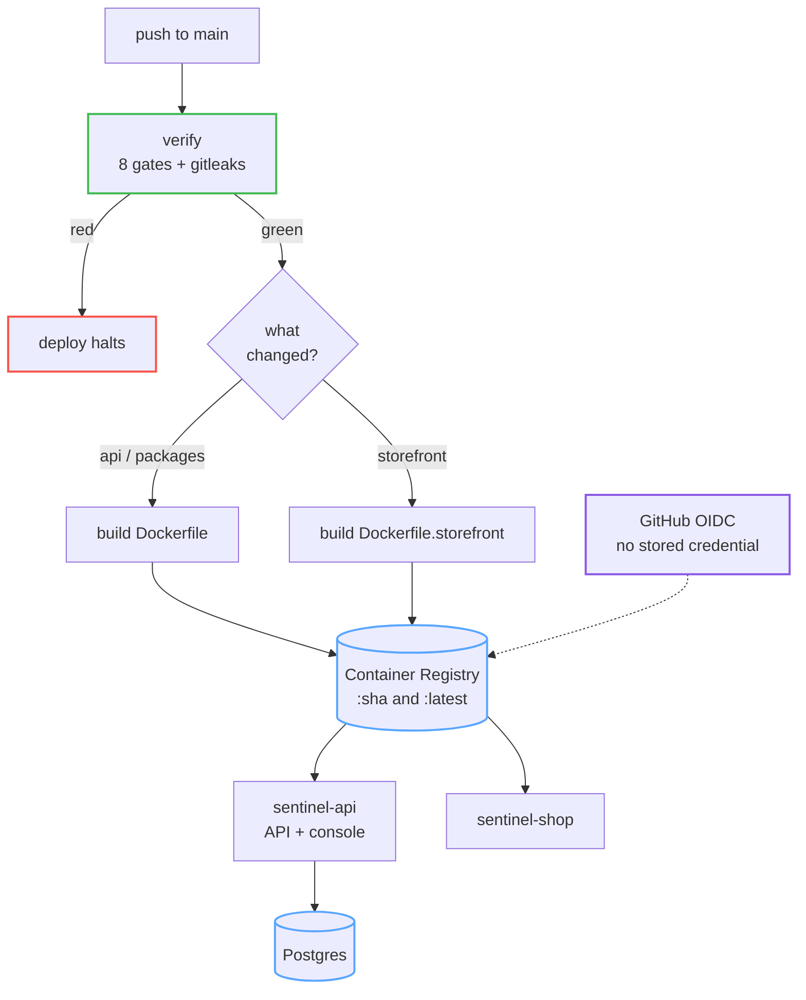

# Setup and deploy

Running Sentinel locally, and putting it on Azure.

---

## 1 · Local, from a clean clone

**Requirements:** Node ≥ 22, pnpm 10.33.0. Nothing else — no database, no Docker, no Razorpay
account, no cloud.

```bash
pnpm install
cp .env.example .env
```

Then generate the two keys that have no defaults:

```bash
node -e "console.log(require('crypto').randomBytes(32).toString('hex'))"   # → PSEUDONYM_KEY_V1
node -e "console.log(require('crypto').randomBytes(32).toString('hex'))"   # → PAYLOAD_KEY_V1
```

Paste each into `.env`. Both must be exactly 64 hex characters, and neither has a fallback — one
baked into the source would make every pseudonym on every installation reproducible by anyone who
read the repository.

They are enforced at different moments, on purpose. **`PSEUDONYM_KEY_V1` is required to boot**:
without it the API will not start. **`PAYLOAD_KEY_V1` is required to accept a webhook**: the API
starts without it, but the ingest endpoint refuses every delivery rather than storing a customer's
email and contact number in plaintext, and the health page reports itself as not configured.

```bash
pnpm dev
```

|            |                                                                    |
| :--------- | :----------------------------------------------------------------- |
| Console    | http://localhost:5173 — `analyst@sentinel.local` / `sentinel-demo`  |
| Storefront | http://localhost:5174                                               |
| API        | http://localhost:3001                                               |

Postgres is compiled to WebAssembly and runs in-process, so `DATABASE_URL` stays empty. Demo accounts
are seeded at boot outside production.

### Seeing it work

Open **Simulation**, pick `attack_distributed`, run it. Traffic streams through the real detection
pipeline — the same code path a live webhook takes — and an incident opens within a few seconds.
Everything it produces is tagged `source: replay` and can never be counted as evidence about live
behaviour.

### Useful commands

```bash
pnpm check          # every CI gate, exactly as the pipeline runs them
pnpm test:unit      # 802 unit tests
pnpm test:e2e       # 28 Playwright specs against a real server
pnpm metrics        # regenerate METRICS.md from the corpus
pnpm audit:verify   # walk the audit hash chain
make help           # the short list
```

### Optional: real Razorpay test-mode webhooks

Not needed for anything above. If you want live deliveries, set `RAZORPAY_WEBHOOK_SECRET` to the
value you chose in the Razorpay dashboard when creating the webhook. Without it the endpoint refuses
every delivery rather than accepting unsigned ones, and the health page says so plainly.

**Test mode only.** Live keys must never appear in `.env`.

---

## 2 · Configuration

[`.env.example`](../.env.example) documents every variable the code reads. Everything has a working
default except the two keys above.

Four worth knowing about:

**`DATABASE_URL`** — empty means embedded Postgres with no server. That is the credential-free path
and the one the end-to-end suite uses. Point it at a real server for a multi-container deployment,
where an in-process database cannot be shared.

**`STOREFRONT_URL`** — set this on the **API container** in a deployment. The web bundle inlines its
own copy at *build* time, so setting only the build variable on an already-built container changes
nothing and the storefront links fall back to same-origin, which is the API. Served at runtime from
`/api/meta`, the built page picks it up with no rebuild.

**`WEB_ORIGIN`** — comma-separated. Every deployed origin must be listed or the browser blocks the
call.

**`TRUST_PROXY`** — leave `false` unless the app genuinely sits behind a proxy you control. It
accepts exactly `true`, `false`, `1` or `0` and rejects anything else at startup, because a
permissive parse here would silently make `X-Forwarded-For` believable from any caller — the one
header an attacker would forge to look like a different shopper on every request.

---

## 3 · Deploying to Azure

Two independently scaled Container Apps in `uaenorth`, built from this repository by GitHub Actions.



### 3.1 Two images, on purpose

| Image                 | Contents                                                              |
| :-------------------- | :-------------------------------------------------------------------- |
| `Dockerfile`          | API **and** the built console, served from **one origin**              |
| `Dockerfile.storefront` | The demo shop, deliberately separate                                |

One origin for the API and console means the session cookie and the API that issues it belong
together, and the authenticated path needs no CORS at all. The storefront is separate because it is a
demo surface and should be able to fail without taking the console with it.

Runtime image is `node:22-slim`, production dependencies only. It ships `policy.yaml` and the model
artifacts. Without the model, scoring degrades to rules-only — a designed and tested path.

### 3.2 Secrets

Set as repository secrets. Nothing is stored in the workflow files.

| Secret                          | Purpose                              |
| :------------------------------ | :----------------------------------- |
| `AZURE_CLIENT_ID`               | OIDC federated identity              |
| `AZURE_TENANT_ID`               |                                      |
| `AZURE_SUBSCRIPTION_ID`         |                                      |
| `AZURE_ACR_NAME`                | Container registry                   |
| `APP_DATABASE_URL`              | Postgres connection string     |
| `APP_PSEUDONYM_KEY`             | 64 hex characters                    |
| `APP_PAYLOAD_KEY`               | 64 hex characters                    |
| `APP_RAZORPAY_KEY_ID`           | Test mode                            |
| `APP_RAZORPAY_KEY_SECRET`       |                                      |
| `APP_RAZORPAY_WEBHOOK_SECRET`   |                                      |

**No cloud credential is stored.** `azure/login@v2` authenticates by GitHub OIDC — a signed claim
naming this repository and branch, exchanged for a short-lived token. There is nothing in the
repository to leak and nothing to rotate.

### 3.3 First-time provisioning

The `Azure setup` workflow runs manually and takes a `step` input:

```
1.  Run  Azure setup  with  step = provision
        creates the Container Apps environment and both apps

2.  Run  Deploy
        builds and pushes the first images

3.  Run  Azure setup  with  step = configure
        resolves both public URLs, then sets every environment
        variable and secret on each app
```

The order matters: `configure` needs the apps to exist and to have resolvable URLs, which only
happens once something is deployed to them. Step 3 is where `STOREFRONT_URL` and `WEB_ORIGIN` are set
from the URLs Azure actually assigned.

### 3.4 Ongoing deploys

Push to `main`. Then:

- **`verify` runs first** and the deploy stops if it is red. Nothing reaches production that has not
  passed the gate a pull request passes.
- **`paths-filter` decides what to rebuild.** A console-only change does not rebuild the storefront.
- **The deploy changes only `--image`.** Every variable, secret and scaling rule lives in
  `azure-setup.yml` and is applied deliberately by running that workflow. A push can change *what*
  runs; it can never change *how it is configured*.
- **A second push supersedes the first** rather than racing it, and an in-progress rollout is never
  cancelled halfway — stopping mid-rollout leaves the revision split somewhere nobody chose.

### 3.5 After deploying

| Check                | How                                                                      |
| :------------------- | :----------------------------------------------------------------------- |
| API is up            | `GET /api/meta` returns 200 with a version and commit                    |
| Storefront links work | `storefrontUrl` in that response is the shop's real URL, not `null`     |
| Webhooks accepted    | System health shows the webhook secret present                            |
| Model loaded         | Settings shows the model card; decisions are not marked `degraded:model` |

If `storefrontUrl` is `null`, `STOREFRONT_URL` is not set on the API container — re-run
`Azure setup` with `step = configure`.

---

## 4 · Troubleshooting

**The API will not start.** Almost always one of the two keys. Both are required, both must be
exactly 64 hex characters, and the error names which one. The other candidate is a missing or
unparseable `policy.yaml`, which is also a deliberate refusal rather than a fallback.

**Storefront links go to the API.** `STOREFRONT_URL` is unset on the API container. Setting the build
variable alone will not fix an already-built image — see §2.

**Browser blocks API calls.** The origin is missing from `WEB_ORIGIN`, which is comma-separated and
must list every deployed origin.

**`check:metrics` fails in CI.** The evaluation was re-run and a published number moved. That is the
gate working. Either the change is intended — commit the regenerated artifacts — or something drifted
and wants investigating.

**`assert nothing changed` fails.** A gate modified a tracked file. Usually the formatter: run
`pnpm format` and commit. It fails deliberately, because a build that silently fixes the tree means
the committed state and the verified state were not the same thing.
